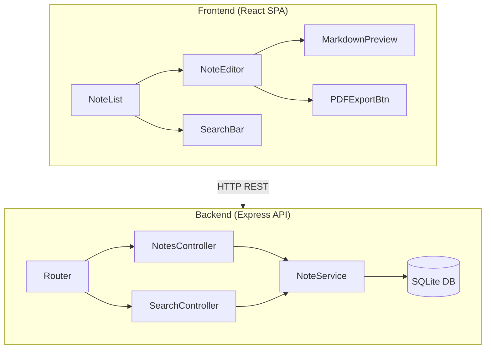
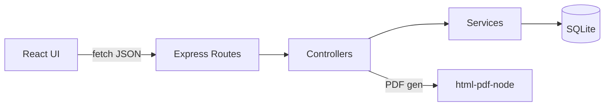
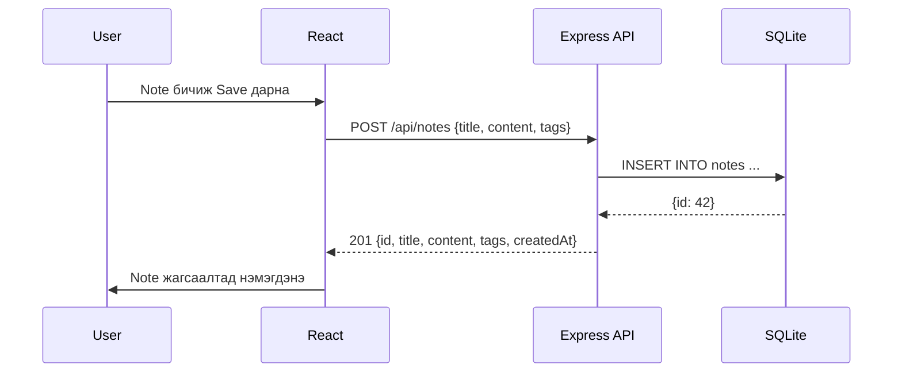

# Architecture — Markdown Note-taking App

## Stack
| Layer | Technology | Шалтгаан |
|-------|-----------|----------|
| Backend | Node.js + Express | Хялбар REST API, npm экосистем |
| Database | SQLite (better-sqlite3) | File-based, тохиргоо шаардахгүй |
| Frontend | React (Vite) | Component-based, хурдан dev |
| PDF | puppeteer / html-pdf-node | Markdown → HTML → PDF |
| Testing | Jest + supertest | Express-тай сайн нийцдэг |

---

## Module diagram



---

## Layer diagram



---

## Data flow — Note үүсгэх



---

## Directory бүтэц

```
bie-daalt-13/
├── partB/
│   ├── src/
│   │   ├── app.js          # Express app setup
│   │   ├── db/
│   │   │   └── database.js # SQLite connection + migrations
│   │   ├── routes/
│   │   │   ├── notes.js    # /api/notes CRUD
│   │   │   └── search.js   # /api/search
│   │   └── middleware/
│   │       └── errorHandler.js
│   ├── tests/
│   │   ├── notes.test.js
│   │   └── search.test.js
│   └── frontend/
│       └── src/
│           ├── App.jsx
│           ├── components/
│           └── api/
```